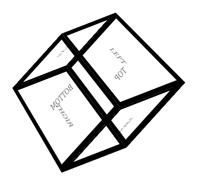
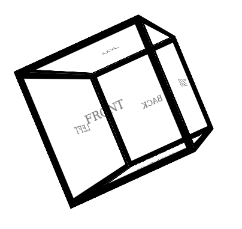

# Animated 3D Cube
It's made with simple HTML and CSS. It is using 3D CSS transforms and perspective.

Also feel free to use and tweak it inside your own project.

Here's the [Live Demo](https://web-utilities.github.io/animated-3d-cube/)

## Screenshots

